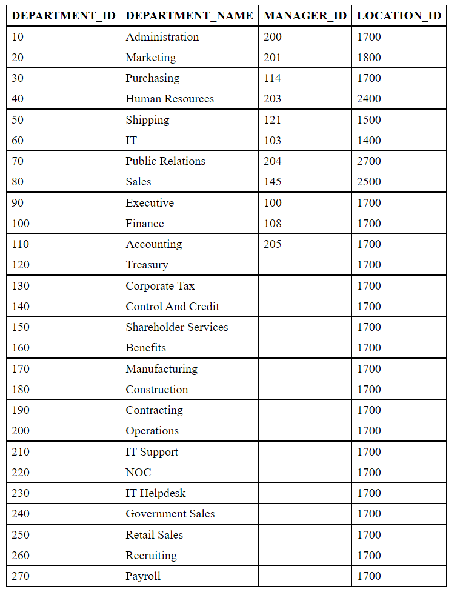
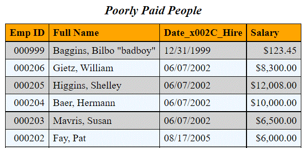

# app_html_table_pkg

Create HTML Table markup from an Oracle query string or SYS_REFCURSOR. Allow for right justifying
selected columns, an optional table caption, and your own local scoped CSS style for the table and
table elements.

# Content

- [Installation](#installation)
- [Use Case](#use-case)
- [Manual Page](#manual-page)
    - [query2html](#query2html)
    - [cursor2html](#cursor2html)
- [Examples](#examples)

# Installation

Clone this repository or download it as a [zip](https://github.com/lee-lindley/app_html_table_pkg/archive/refs/heads/main.zip) archive.

`git clone https://github.com/lee-lindley/app_html_table_pkg.git`

## install.sql

*install.sql* is a simple compile of the package specification and body.

`sqlplus YourLoginConnectionString @install.sql`

# Use Case

Present HTML Table markup from an Oracle query while right aligning numeric data in the cells.
This is not a full HTML document, but a section that you can include in a larger HTML body. For example:

    SELECT app_html_table_pkg.get_clob(q'!SELECT * FROM hr.departments!')
    FROM dual;

The resulting markup text is enclosed with a \<div\> tag and can be added to an HTML email or otherwise included
in an HTML document.

While here, it turned out to be not so difficult to provide a way for you to insert your own
style choices for the table via CSS. You do not need to be a CSS guru to do it. The pattern
from the examples will be enough for most.

The common method for generating HTML markup tables from SQL queries in Oracle
is to use DBMS_XMLGEN and XSLT conversions via XMLType. A search of the web will
turn up multiple demonstrations of the technique. It works reasonably well, but there are
some gotchas like column headers with spaces get munged to \_x0020\_ and all data is left justified
in the cells.

A big drawback is that we often want to right justify numeric data. In plain text output we can use LPAD(TO_CHAR... 
(or just TO_CHAR) to simulate right justification, 
but HTML does not respect spaces unless we use **pre**, and even then I'm not sure
we can count on the font to not mess up our alignment. I'm not an HTML or XSLT expert, but I do not think
preserving white space helps.

We need to use a right alignment style modifier on the table data tag when we want numbers right aligned. We 
can do so with a custom local scoped style that sets the alignment for particular columns.

# Manual Page

## query2html

```sql
    FUNCTION query2html(
        p_sql                           CLOB
        ,p_right_align_col_list         VARCHAR2 := NULL -- comma separated integers in string
        ,p_caption                      VARCHAR2 := NULL
        ,p_css_scoped_style             VARCHAR2 := NULL
    ) RETURN CLOB
    ;
```
The returned CLOB using the default
scoped style and no caption looks as follows;
however, the two style elements below with "**text-align:right;**" are customized via
a *p_right_align_col_list* value of '1, 4'.

	<div id="plsql-table">
	<style type="text/css" scoped>
	table {
	    border: 1px solid black;
	    border-spacing: 0;
	    border-collapse: collapse;
	}
    caption {
        font-style: italic;
        font-size: larger;
        margin-bottom: 0.5em;
    }
    th {
        text-align:left;
    }
	th, td {
	    border: 1px solid black;
	    padding:4px 6px;
	}
	tr > td:nth-of-type(1) {
	    text-align:right;
	}
	tr > td:nth-of-type(4) {
	    text-align:right;
	}
	</style>
	<table>
	<tr><th>Emp ID</th><th>Fname</th><th>Date,Hire,YYYYMMDD</th><th>Salary</th></tr>
	<tr><td>102</td><td>De Haan, Lex</td><td>20010113</td><td>$17,000.00</td></tr>
    ...
	</table></div>

### p_sql

A string containing the SQL statement to execute.

### p_right_align_col_list

A string that contains a comma separated list of column numbers. It must be NULL or 
match the regular expression '^(\s*\d+\s*(,|$))+$'
else an error will be raised. This produces the

    tr > td:nth-of-type(__colnum__) {
	    text-align:right;
	}

elements in the local style where \_\_colnum\_\_ is the column number.

### p_caption

If provided, will be wrapped with \<caption\> \</caption\> and inserted following the \<table\> tag.

### p_css_scoped_style

Do not include the \<style\> \</style\> elements as the function will add those. Everything else
that the function provides by default you are responsible for.

You will notice I've stayed away from specifying actual fonts. Religious wars are started by mentioning
a preference. This just lets the client set the font other than tweaks we do for style, weight and relative
size. That said, I can make a case for a mono-spaced fault for tables; however, I recognize that as a programmer
my font preferences are shaped by what I do and I'm in the minority.

## cursor2html

```sql
    FUNCTION cursor2html(
        p_src                           SYS_REFCURSOR
        ,p_right_align_col_list         VARCHAR2 := NULL -- comma separated integers in string
        ,p_caption                      VARCHAR2 := NULL
        ,p_css_scoped_style             VARCHAR2 := NULL
    ) RETURN CLOB
    ;
```

### p_src

An open SYS_REFCURSOR. This form allows you to use bind variables in your query. *query2html* opens
a SYS_REFCURSOR and calls *cursor2html* to do the work. 

Other parameters are the same as *query2html*.

# Examples

## Example 0

A simple query with no alignment overrides. Everything is left justified.

```sql
SELECT app_html_table_pkg.query2html(q'!SELECT * FROM hr.departments!')
FROM dual;
```

|  |
|:--:|
| Example 0 Simple Query |

## Example 1

All kinds of shenanigans going on here. 

- We set *p_right_align_col_list* to '1, 4' to get the first and fourth columns right justified.
- We add a caption
- We provide a custom style that starts with the default one in the package and tweaks it.
    - Make the caption bold/italic instead of just italic.
    - Set the background color for the column headers to LightGrey.
    - Every odd numbered row gets a background color of AliceBlue

Pretty fancy! But given that you have the default CSS code from the package
plus this example, it is not that
much of a stretch to make your table look the way you want.

```sql
SELECT app_html_table_pkg.query2html(p_sql => q'[
        SELECT TO_CHAR(employee_id, '099999') AS "Emp ID", last_name||', '||first_name AS "Full Name", hire_date AS "Date,Hire", TO_CHAR(salary,'$999,999.99') AS "Salary"
        from hr.employees
        UNION ALL
        SELECT '000999' AS "Emp ID", '  Baggins, Bilbo "badboy" ' AS "Full Name", TO_DATE('19991231','YYYYMMDD') AS "Date,Hire", TO_CHAR(123.45,'$999,999.99') AS "Salary"
        FROM dual
        ORDER BY "Emp ID" desc]'
                                    ,p_caption              => 'Poorly Paid People'
                                    ,p_right_align_col_list => '1,4'
                                    ,p_css_scoped_style     => q'!
table {
    border: 1px solid black; 
    border-spacing: 0; 
    border-collapse: collapse;
}
caption {
    font-style: italic;
    font-weight: bold;
    font-size: larger;
    margin-bottom: 0.5em;
}
th {
    text-align:left;
    background-color: LightGrey
}
th, td {
    border: 1px solid black; 
    padding:4px 6px;
}
tr:nth-child(odd) { background-color: AliceBlue }
!'
    )
FROM dual;
```

|  |
|:--:|
| Example 1 Fancy Shenanigans |

The function changed '\_x0020\_' to spaces in the column headers, thus dealing with one common problem
of using DBMS_XMLGEN, but we did not try to fix the issue of having a comma in your column alias. Other non-alpha characters
could be encoded as well. You are on your own for that.

Overall this is a pretty fancy result for a bit of copy/pasting and tweaking of the provided style.
